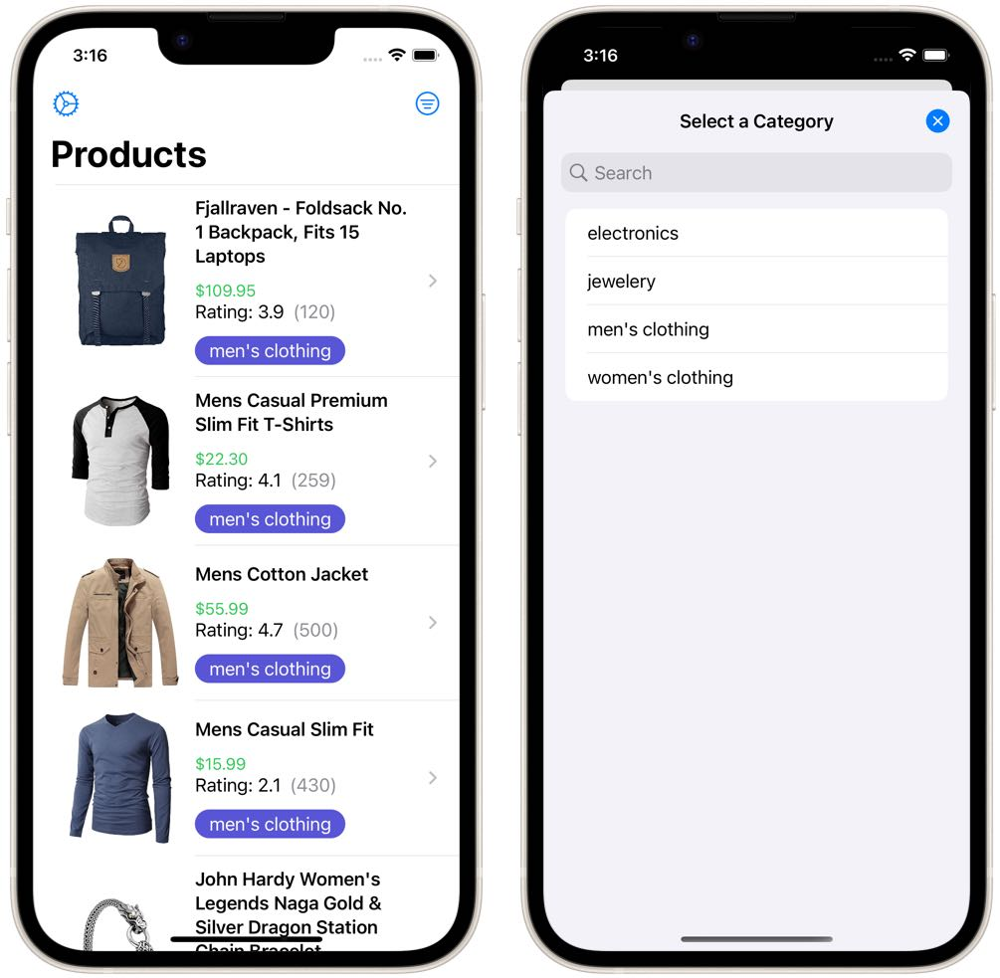
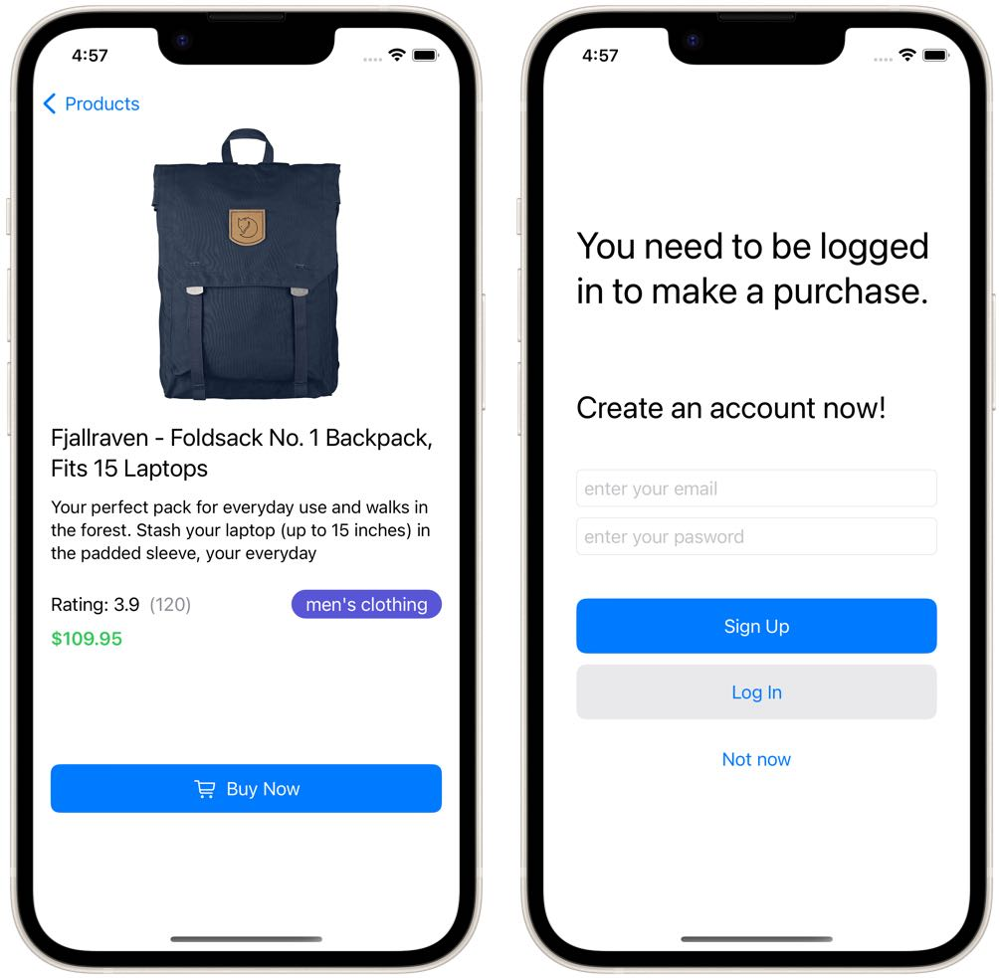

# Demo Project for SwiftUI Presentataion

This project is a simple Shopping App based on the  Fake Store API https://fakestoreapi.com/

It demonstrates the following points:
- SwiftUI sheets and fullscreenCover
- presentationDetents, presentationCornerRadius, presentationBackground
- how to dimiss views 
- popovers in SwiftUI
- alerts, actionsheets and confirmationDialog

this is used for SwiftyPlace blog posts. You can read how about it here:
- https://www.swiftyplace.com/blog/swiftui-sheets-modals-bottom-sheets-fullscreen-presentation-in-ios
- https://www.swiftyplace.com/blog/swiftui-action-sheets-and-confirmation-dialog
- https://www.swiftyplace.com/blog/swiftui-alerts
- https://www.swiftyplace.com/blog/swiftui-popovers-and-popups

## Use a sheet to show categories

## Use fullscreenCover to ask the user to create an account

